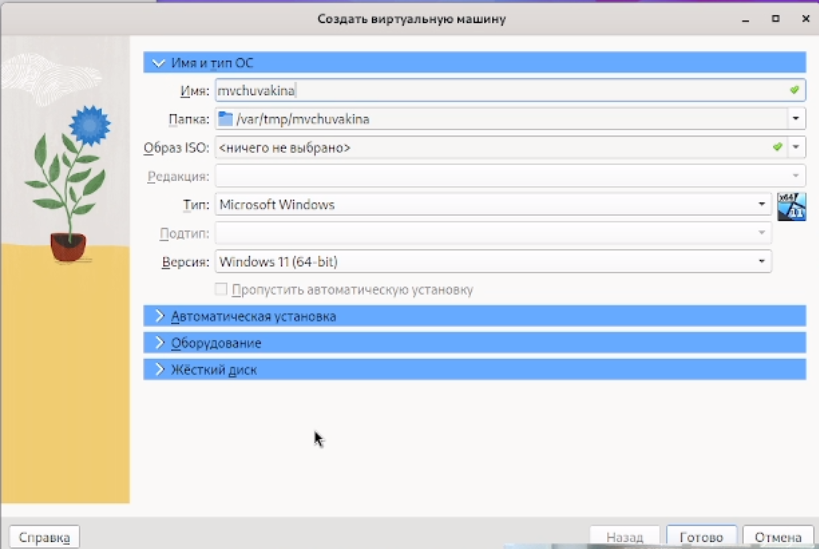
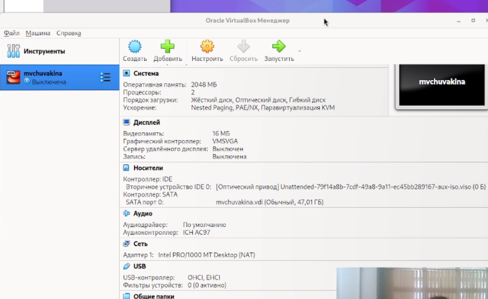
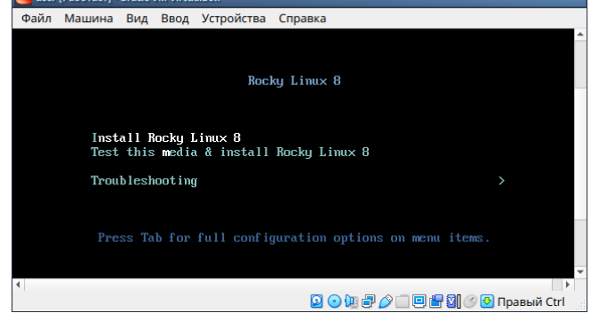
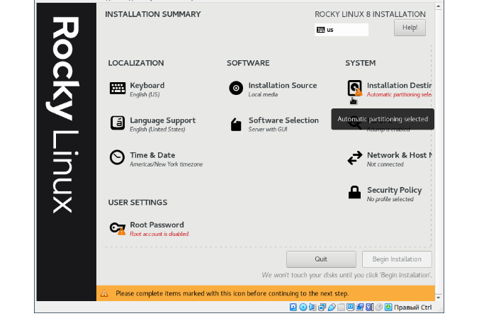
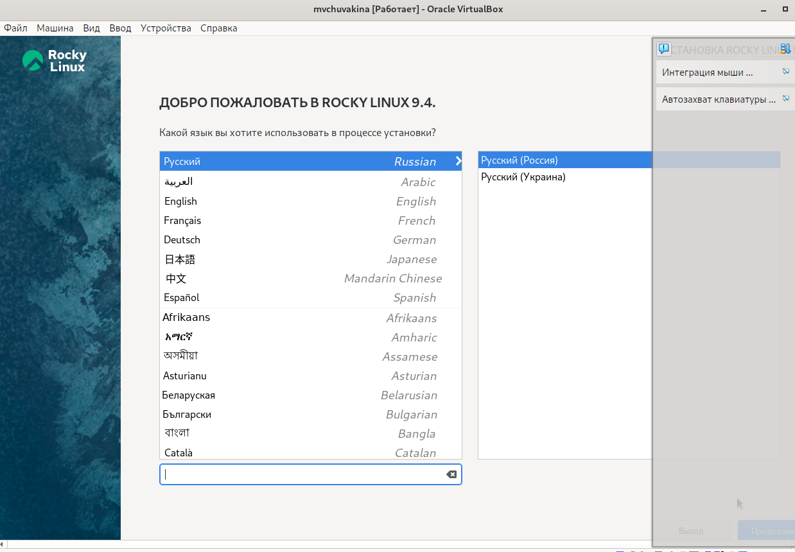
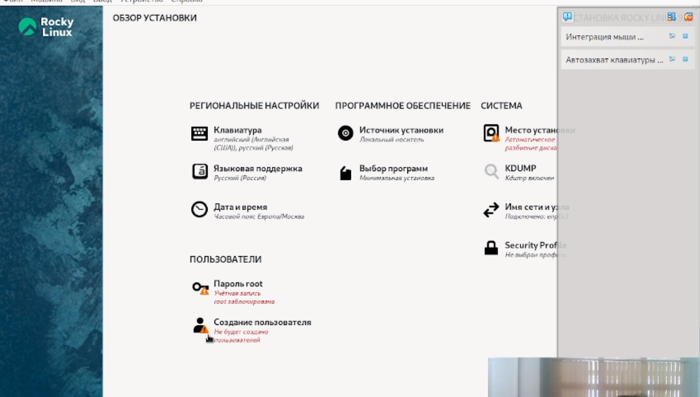
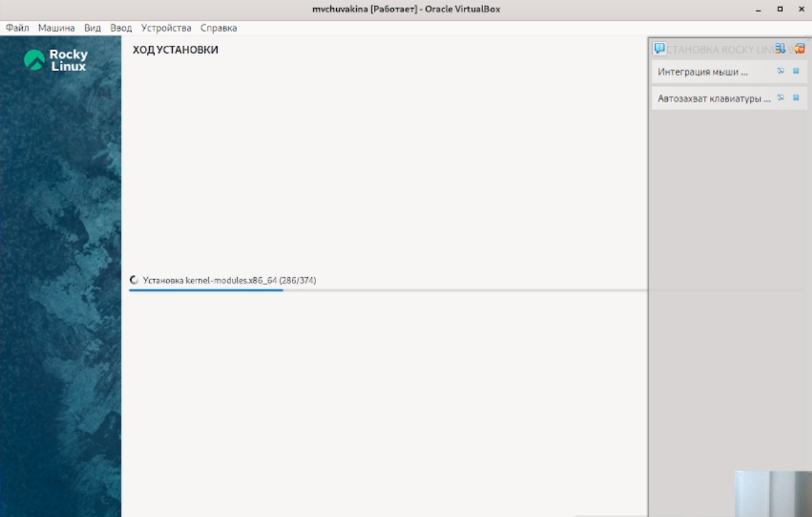

---
## Front matter
lang: ru-RU
title: Презентация по лабораторной работе №1
subtitle: Основы информационной безопасности
author:
  - Чувакина М. В.
institute:
  - Российский университет дружбы народов, Москва, Россия
date: 17 февраля 2025

## i18n babel
babel-lang: russian
babel-otherlangs: english

## Formatting pdf
toc: false
toc-title: Содержание
slide_level: 2
aspectratio: 169
section-titles: true
theme: metropolis
header-includes:
 - \metroset{progressbar=frametitle,sectionpage=progressbar,numbering=fraction}
---

# Информация

## Докладчик

:::::::::::::: {.columns align=center}
::: {.column width="70%"}

  * Чувакина Мария Владимировна
  * студентка группы НКАбд-03-23
  * Российский университет дружбы народов
  * [1132236055@rudn.ru](mailto:1132236055@rudn.ru)
  * <https://mvchuvakina.github.io/ru/>

:::
::: {.column width="30%"}

:::
::::::::::::::

## Цель

Целью данной работы является приобретение практических навыков
установки операционной системы на виртуальную машину, настройки ми-
нимально необходимых для дальнейшей работы сервисов.

## Задание

1. Установка и настройка операционной системы.
2. Найти следующую информацию:
	1. Версия ядра Linux (Linux version).
	2. Частота процессора (Detected Mhz processor).
	3. Модель процессора (CPU0).
	4. Объем доступной оперативной памяти (Memory available).
	5. Тип обнаруженного гипервизора (Hypervisor detected).
	6. Тип файловой системы корневого раздела.

## Выполнение лабораторной работы

Я выполняю лабораторную работу на домашнем оборудовании, поэтому создаю новую виртуальную машину в VirtualBox, выбираю имя, местоположение  и образ ISO, устанавливать будем операционную систему Rocku DVD

{#fig:001 width=70%}

## Соглашаюсь с проставленными настройками

{#fig:005 width=70%}

## Начинается загрузка операционной системы 

{#fig:006 width=70%}

## При этом должен быть подключен в носителях образ диска!

{#fig:007 width=70%}

## Выбираю язык установки 

{#fig:008 width=70%}

## В обзоре установки будем проверять все настройки и менять на нужные 

{#fig:009 width=70%}

## Начало установки 

{#fig:011 width=70%}

## Вывод

Я приобрела практические навыки
установки операционной системы на виртуальную машину, настройки ми-
нимально необходимых для дальнейшей работы сервисов.

:::

