---
## Front matter
lang: ru-RU
title: Презентация по лабораторной работе №2
subtitle: Основы информационной безопасности
author:
  - Чувакина М. В.
institute:
  - Российский университет дружбы народов, Москва, Россия
date: 24 января 2025

## i18n babel
babel-lang: russian
babel-otherlangs: english

## Formatting pdf
toc: false
toc-title: Содержание
slide_level: 2
aspectratio: 169
section-titles: true
theme: metropolis
header-includes:
 - \metroset{progressbar=frametitle,sectionpage=progressbar,numbering=fraction}
---

# Информация

## Докладчик

:::::::::::::: {.columns align=center}
::: {.column width="70%"}

  * Чувакина Мария Владимировна
  * студентка группы НКАбд-03-23
  * Российский университет дружбы народов
  * [1132236055@rudn.ru](mailto:1132236055@rudn.ru)
  * <https://mvchuvakina.github.io/ru/>

:::
::: {.column width="30%"}


:::
::::::::::::::

# Цель работы

Получение практических навыков работы в консоли с атрибутами фай-
лов, закрепление теоретических основ дискреционного разграничения до-
ступа в современных системах с открытым кодом на базе ОС Linux.

# Задание

1. Работа с атрибутами файлов
2. Заполнение таблицы "Установленные права и разрешённые действия" (см. табл. 2.1)
3. Заполнение таблицы "Минимальные права для совершения операций" (см. табл. 2.2)


# Выполнение лабораторной работы

## 1

Cоздаю нового пользователя guest через учетную запись администратора

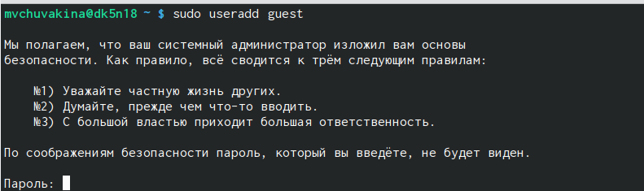{#fig:001 width=70%}

## 2

Далее задаю пароль для созданной учетной записи 


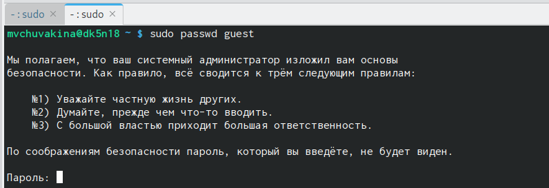{#fig:002 width=70%}

## 3

Определяю с помощью команды pwd, что я нахожусь в директории /home/guest/. Эта директория является домашней, ведь в приглашении командой строкой стоит значок ~, указывающий, что я в домашней директории

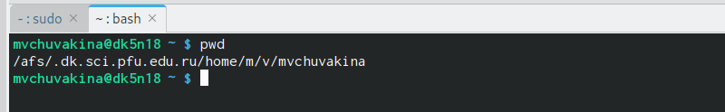{#fig:003 width=70%}

## 4

Уточняю имя пользователя

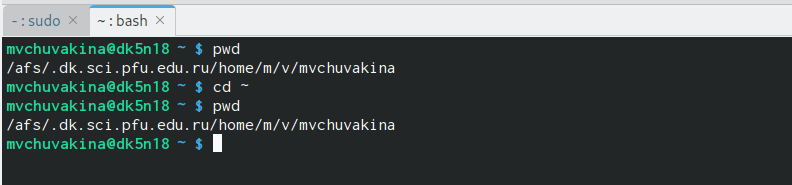{#fig:004 width=70%}

## 5

В выводе команды groups информация только о названии группы, к которой относится пользователь. В выводе команды id можно найти больше информации: имя пользователя и имя группы, также коды имени пользователя и группы 

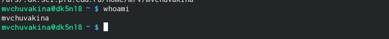{#fig:005 width=70%}

## 6

Имя пользователя в приглашении командной строкой совпадает с именем пользователя, которое выводит команда whoami 

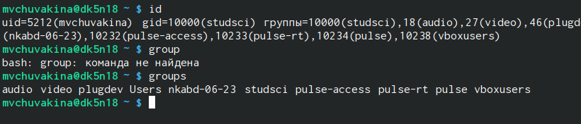{#fig:006 width=70%}

## 7

Получаю информацию о пользователе с помощью команды 
```
cat /etc/passwd | grep guest
```

В выводе получаю коды пользователя и группы, адрес домашней директории

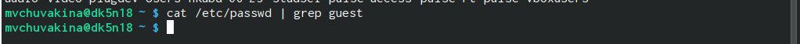{#fig:007 width=70%}

## 8

Да, список поддиректорий директории home получилось получить с помощью команды ls -l, если мы добавим опцию -a, то сможем увидеть еще и директорию пользователя root. Права у директории:

root: drwxr-xr-x,

evdvorkina и guest: drwx------.

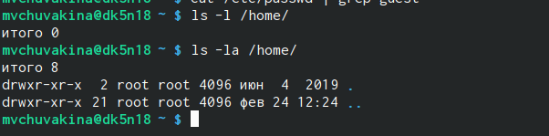{#fig:008 width=70%}

## 9

Пыталась проверить расширенные атрибуты директорий. Нет, их увидеть не удалось. Увидеть расширенные атрибуты других пользователей, тоже не удалось, для них даже вывода списка директорий не было.

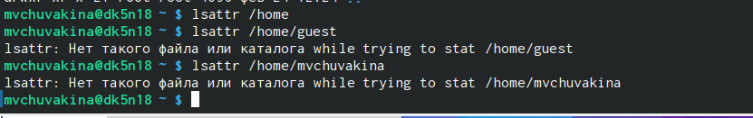{#fig:009 width=70%}

## 10

Создаю поддиректорию dir1 для домашней директории. Расширенные атрибуты командой lsattr просмотреть у директории не удается, но атрибуты есть: drwxr-xr-x, их удалось просмотреть с помощью команды ls -l.

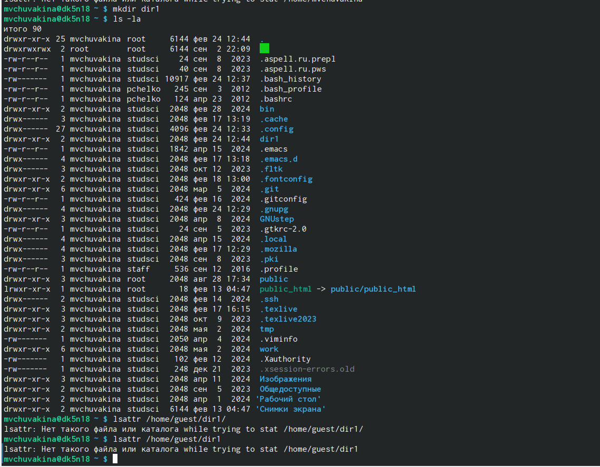{#fig:010 width=70%}

## 11

Снимаю атрибуты командой chmod 000 dir1, при проверке с помощью команды ls -l видно, что теперь атрибуты действительно сняты.
 
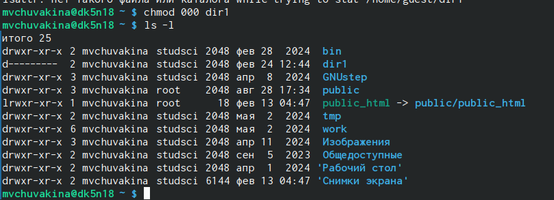{#fig:011 width=70%}

## 12

Попытка создать файл в директории dir1. Выдает ошибку: "Отказано в доступе". 

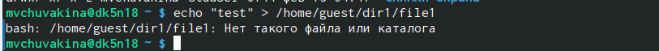{#fig:012 width=70%}

Вернув права директории и использовав снова командy ls -l можно убедиться, что файл не был создан.


## 13. Таблица 2.2 "Минимальные права для совершения операций"

| | | | | |
|-|-|-|-|-|
|Операция| |Минимальные  права на  директорию| |Минимальные  права на файл|
|Создание файла| |d(300)| |-|
|Удаление файла| |d(300)| |-|
|Чтение файла| |d(100)| |(400)|
|Запись в файл| |d(100)| |(200)|
|Переименование файла| |d(300)| |(000)|
|Создание поддиректории| |d(300)| |-|
|Удаление поддиректории| |d(300)| |-|

## Вывод

Были получены практические навыки работы в консоли с атрибутами файлов, закреплены теоретические основы дискреционного разграничения доступа в современных системах с открытым кодом на базе ОС Linux.

