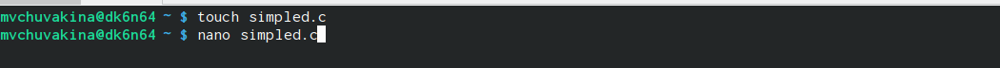
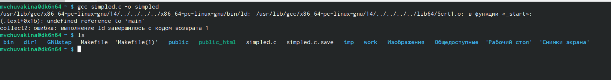
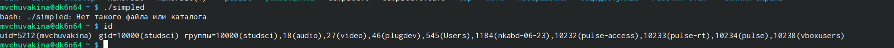
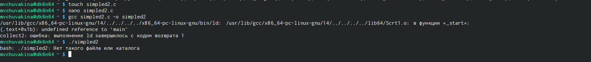
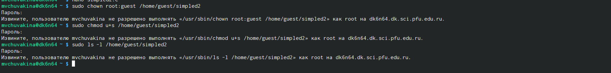
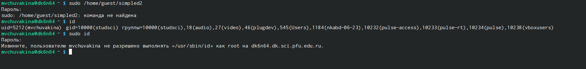
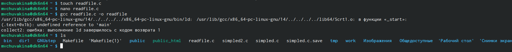
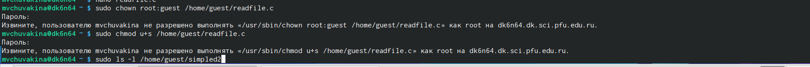
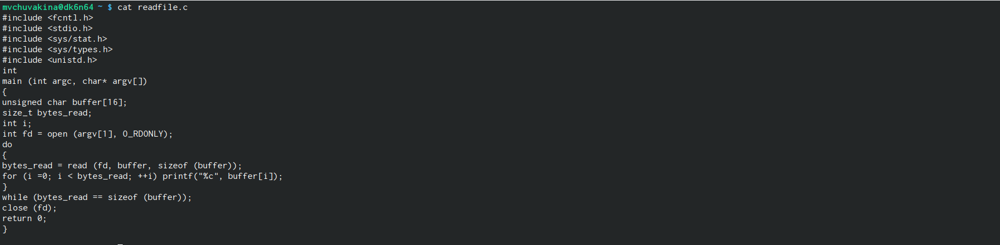
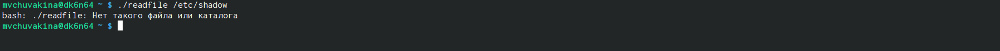

---
## Front matter
lang: ru-RU
title: Презентация по лабораторной работе №5
subtitle: Основы информационной безопасности
author:
  - Чувакина М. В.
institute:
  - Российский университет дружбы народов, Москва, Россия
date: 14 апреля 2025

## i18n babel
babel-lang: russian
babel-otherlangs: english

## Fonts
mainfont: PT Serif
romanfont: PT Serif
sansfont: PT Sans
monofont: PT Mono
mainfontoptions: Ligatures=TeX
romanfontoptions: Ligatures=TeX
sansfontoptions: Ligatures=TeX,Scale=MatchLowercase
monofontoptions: Scale=MatchLowercase,Scale=0.9

## Formatting pdf
toc: false
toc-title: Содержание
slide_level: 2
aspectratio: 169
section-titles: true
theme: metropolis
header-includes:
 - \metroset{progressbar=frametitle,sectionpage=progressbar,numbering=fraction}
---

# Информация

## Докладчик

:::::::::::::: {.columns align=center}
::: {.column width="70%"}

  * Чувакина Мария Владимировна
  * студентка из группы НКАбд-03-23
  * Российский университет дружбы народов
  * [1132236055@rudn.ru](mailto:1132236055@rudn.ru)
  * <https://mvchuvakina.github.io/ru/>

:::
::: {.column width="30%"}

:::
::::::::::::::

## Цель

Изучение механизмов изменения идентификаторов, применения
SetUID- и Sticky-битов. Получение практических навыков работы в кон-
соли с дополнительными атрибутами. Рассмотрение работы механизма
смены идентификатора процессов пользователей, а также влияние бита
Sticky на запись и удаление файлов.

## Выполнение лабораторной работы

Создание файла simpled.c и запись в файл кода 

{#fig:003 width=70%}

## Выполнение лабораторной работы

Компилирую файл, проверяю, что он скомпилировался 

{#fig:005 width=70%}

## Выполнение лабораторной работы

Запускаю исполняемый файл. В выводе файла выписыны номера пользоватея и групп, от вывода при вводе if, они отличаются только тем, что информации меньше 

{#fig:006 width=70%}

## Выполнение лабораторной работы

Создание, запись в файл и компиляция файла simpled2.c. Запуск программы 

{#fig:007 width=70%}

## Выполнение лабораторной работы

С помощью chown изменяю владельца файла на суперпользователя, с помощью chmod изменяю права доступа 

{#fig:009 width=70%}

## Выполнение лабораторной работы

Сравнение вывода программы и команды id, наша команда снова вывела только ограниченное количество информации

{#fig:010 width=70%}

## Выполнение лабораторной работы

Создание и компиляция файла readfile.c 

{#fig:011 width=70%}

## Выполнение лабораторной работы

Снова от имени суперпользователи меняю владельца файла readfile. Далее меняю права доступа так, чтобы пользователь guest не смог прочесть содержимое файла 

{#fig:013 width=70%}

## Выполнение лабораторной работы

Проверка прочесть файл от имени пользователя guest. Прочесть файл не удается 

{#fig:014 width=70%}

## Выполнение лабораторной работы

Попытка прочесть тот же файл с помощью программы readfile, в ответ получаем "отказано в доступе"

Попытка прочесть файл `\etc\shadow` с помощью программы, все еще получаем отказ в доступе 

{#fig:016 width=70%}

## Выполнение лабораторной работы

Проверяем папку tmp на наличие атрибута Sticky, т.к. в выводе есть буква t, то атрибут установлен 

## Выполнение лабораторной работы

От имени пользователя guest создаю файл с текстом, добавляю права на чтение и запись для других пользователей 

## Выполнение лабораторной работы

Вхожу в систему от имени пользователя guest2, от его имени могу прочитать файл file01.txt, но перезаписать информацию в нем не могу 

## Выполнение лабораторной работы

Также невозможно добавить в файл file01.txt новую информацию от имени пользователя guest2

## Выполнение лабораторной работы

Далее пробуем удалить файл, снова получаем отказ 

## Выполнение лабораторной работы

От имени суперпользователя снимаем с директории атрибут Sticky 

## Выполнение лабораторной работы

Далее был выполнен повтор предыдущих действий. По результатам без Sticky-бита запись в файл и дозапись в файл осталась невозможной, зато удаление файла прошло успешно 

## Вывод

Изучила механизм изменения идентификаторов, применила
SetUID- и Sticky-биты. Получила практические навыки работы в кон-
соли с дополнительными атрибутами. Рассмотрела работы механизма
смены идентификатора процессов пользователей, а также влияние бита
Sticky на запись и удаление файлов.

:::

