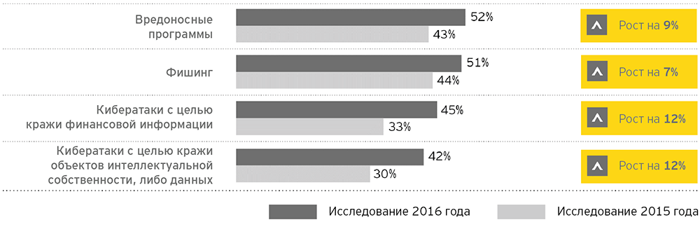
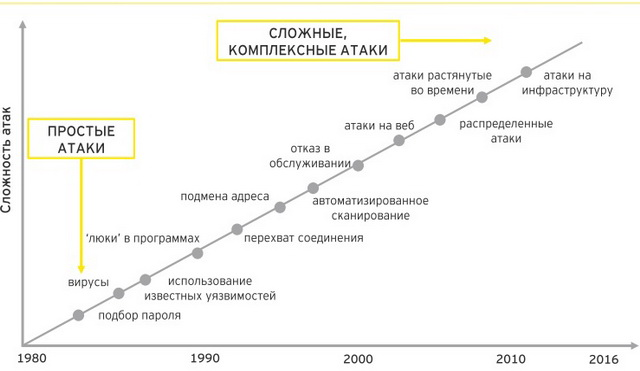

---
## Front matter
lang: ru-RU
title: Информация как ценность. Понятие об информационных угрозах
subtitle: Основы информационной безопасности
author:
  - Чувакина М.В.
institute:
  - Российский университет дружбы народов, Москва, Россия
date: 24 марта 2025

## Fonts
mainfont: PT Serif
romanfont: PT Serif
sansfont: PT Sans
monofont: PT Mono
mainfontoptions: Ligatures=TeX
romanfontoptions: Ligatures=TeX
sansfontoptions: Ligatures=TeX,Scale=MatchLowercase
monofontoptions: Scale=MatchLowercase,Scale=0.9

## i18n babel
babel-lang: russian
babel-otherlangs: english

## Formatting pdf
toc: false
toc-title: Содержание
slide_level: 2
aspectratio: 169
section-titles: true
theme: metropolis
header-includes:
 - \metroset{progressbar=frametitle,sectionpage=progressbar,numbering=fraction}
---

# Информация

## Докладчик

:::::::::::::: {.columns align=center}
::: {.column width="70%"}

  * Чувакина Мария Владимировна
  * студентка группы НКАбд-03-23
  * Российский университет дружбы народов
  * [1132236055@rudn.ru](mailto:1132236055@rudn.ru)
  * <https://mvchuvakina.github.io/ru/>

:::
::: {.column width="30%"}

:::
::::::::::::::

## Информация как ценность

 Ценность информации оп­ределяется степенью ее полезности для владельца. Обладание ис­тинной (достоверной) информацией дает ее владельцу определен­ные преимущества. 
 

 
## Категории для обозначения ценности коммерческой информации

Для обозначения ценности конфиденциальной коммерческой информации используются три категории:

- «коммерческая тайна - строго конфиденциально»;

- «коммерческая тайна - конфиденциально»;

- «коммерческая тайна».

## Градация ценности информации

Используется и другой подход к градации ценности коммер­ческой информации:

- «строго конфиденциально - строгий учет»;

- «строго конфиденциально»;

- «конфиденциально».

## Понятие об информационных угрозах

Угрозы информационной (компьютерной) безопасности — это различные действия, которые могут привести к нарушениям состояния защиты информации. Другими словами, это — потенциально возможные события, процессы или действия, которые могут нанести ущерб информационным и компьютерным системам. Угрозы ИБ можно разделить на два типа: естественные и искусственные.

## Классификация угроз информационной безопасности

В зависимости от различных способов классификации все возможные угрозы информационной безопасности можно разделить на следующие основные подгруппы:

- Нежелательный контент 
- Несанкционированный доступ 
- Утечки информации
- Потеря данных 
- Мошенничество 
- Кибервойны 
- Кибертерроризм

## Классификация угроз информационной безопасности

## Источник угроз информационной безопасности

Нарушение режима информационной безопасности может быть вызвано как спланированными операциями злоумышленников, так и неопытностью сотрудников. Пользователь должен иметь хоть какое-то понятие об ИБ, вредоносном программном обеспечении, чтобы своими действиями не нанести ущерб компании и самому себе. Основными источниками угроз являются отдельные злоумышленники («хакеры»), киберпреступные группы и государственные спецслужбы (киберподразделения), которые применяют весь арсенал доступных киберсредств, перечисленных и описанных выше.

## Источник угроз информационной безопасности

## Программы, помогающие организовывать информационную безопасность

Организовать информационную безопасность помогут специализированные программы, разработанные на основе современных технологий: 
- защита от нежелательного контента (антивирус, антиспам, веб-фильтры, анти-шпионы); 
- сетевые экраны и системы обнаружения вторжений (IPS); 
- управление учетными данными (IDM); 
- контроль привилегированных пользователей (PUM); 
- защита от DDoS; и др.

## Заключение

В современном обществе информация является одним из самых ценных ресурсов. Угрозы информационной безопасности, как естественные, так и искусственные, могут привести к серьезным последствиям, включая утечку данных, финансовые потери и ущерб репутации. Важно понимать, что источниками угроз могут быть как внешние злоумышленники, так и внутренние факторы, такие как неосторожность сотрудников.

Для эффективной защиты информации необходимо применять комплексный подход, который включает в себя как технические меры, так и обучение персонала. Использование современных технологий и программного обеспечения, таких как антивирусы, системы обнаружения вторжений и DLP-системы, позволяет минимизировать риски и повысить уровень безопасности данных.

:::

